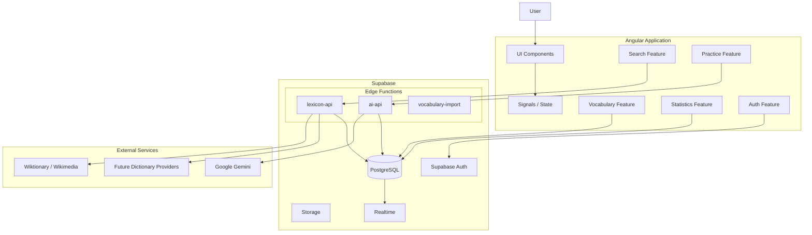
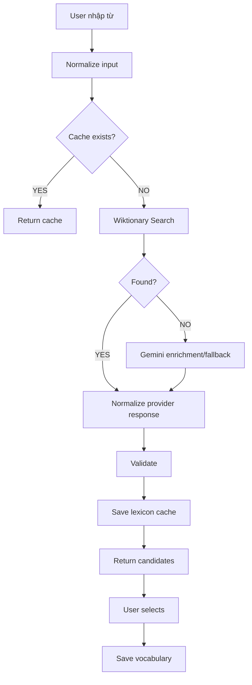
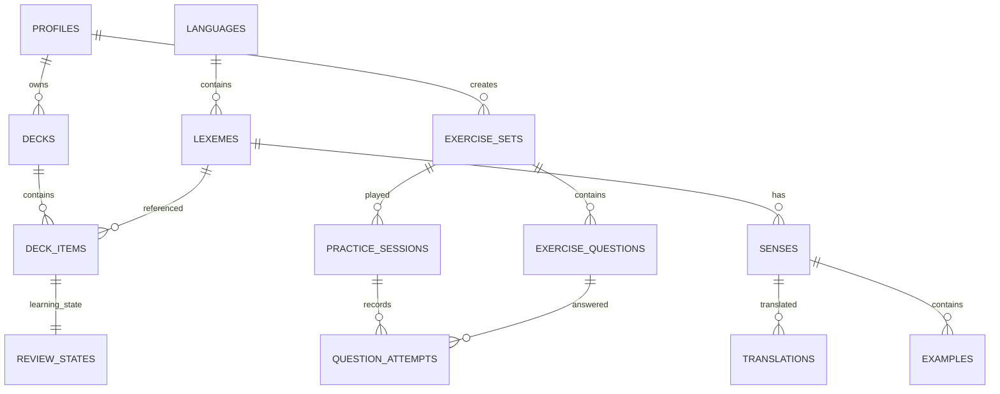
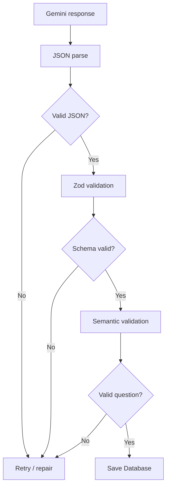
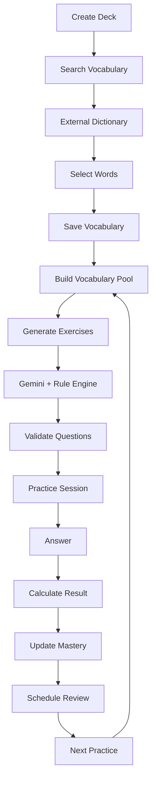

# BLUEPRINT DESIGN

# GLOBAL VOCABULARY LEARNING PLATFORM

**Frontend:** Angular
**Backend/BaaS:** Supabase
**Database:** PostgreSQL
**AI Engine:** Google Gemini API
**Vocabulary Search:** Wiktionary / Wikimedia API + provider abstraction
**Client Search:** Fuse.js
**Authentication:** Supabase Auth
**Server Logic:** Supabase Edge Functions
**Storage:** Supabase Storage
**Realtime:** Supabase Realtime

---

# 1. Mục tiêu hệ thống

Xây dựng một nền tảng học từ vựng đa ngôn ngữ với mục tiêu:

- Không giới hạn cố định tiếng Anh, Nhật, Hàn...
- Kiến trúc có khả năng hỗ trợ các ngôn ngữ sử dụng mã chuẩn quốc tế.
- Người dùng không phải nhập thủ công toàn bộ thông tin của một từ.
- Chỉ cần nhập/search một từ.
- Hệ thống tự tìm:
  - nghĩa;
  - loại từ;
  - phiên âm;
  - cách đọc;
  - ví dụ;
  - các nghĩa khác;
  - từ đồng nghĩa;
  - từ trái nghĩa;
  - bản dịch;
  - dữ liệu âm thanh nếu nguồn hỗ trợ.
- Có thể chọn nhiều kết quả và thêm hàng loạt vào kho từ.
- Gemini tự động tạo bài tập từ kho từ đã lưu.
- Theo dõi mức độ ghi nhớ của từng từ.
- Tự xác định những từ người dùng yếu để ưu tiên ôn tập.
- Có thể mở rộng thành web/PWA/mobile trong tương lai.

---

# 2. Nguyên tắc kiến trúc

Hệ thống chia thành 5 tầng chính.

```text
┌──────────────────────────────────────────────────────────┐
│                    ANGULAR CLIENT                        │
│                                                          │
│ Search / Vocabulary / Flashcard / Practice / Statistics │
└──────────────────────┬───────────────────────────────────┘
                       │
                       │ JWT
                       ▼
┌──────────────────────────────────────────────────────────┐
│                    SUPABASE                              │
│                                                          │
│ Auth │ PostgreSQL │ Storage │ Realtime │ RLS            │
└───────────┬──────────────────────┬───────────────────────┘
            │                      │
            ▼                      ▼
┌─────────────────────┐   ┌──────────────────────────────┐
│ Vocabulary Service  │   │       AI Service             │
│ Edge Function       │   │       Edge Function          │
└──────────┬──────────┘   └──────────────┬───────────────┘
           │                             │
           ▼                             ▼
┌─────────────────────┐       ┌──────────────────────────┐
│ Wiktionary /        │       │ Google Gemini API        │
│ Dictionary Provider │       │                          │
└─────────────────────┘       └──────────────────────────┘
```

**Quy tắc quan trọng:**

```text
Angular KHÔNG BAO GIỜ
        │
        ├── chứa GEMINI_API_KEY
        ├── chứa service_role_key
        └── gọi Gemini trực tiếp
```

Gemini API Key chỉ được đặt trong Supabase Secrets.

Angular chỉ được phép biết:

```env
SUPABASE_URL
SUPABASE_PUBLISHABLE_KEY
```

---

# 3. Kiến trúc tổng thể



---

# 4. Công nghệ

| Layer               | Technology                         |
| ------------------- | ---------------------------------- |
| Frontend            | Angular                            |
| Language            | TypeScript                         |
| UI                  | Angular Material hoặc TailwindCSS |
| Form                | Angular Reactive Forms             |
| State               | Angular Signals                    |
| Async               | RxJS                               |
| Client fuzzy search | Fuse.js                            |
| Backend             | Supabase                           |
| Database            | PostgreSQL                         |
| Authentication      | Supabase Auth                      |
| Authorization       | PostgreSQL RLS                     |
| API backend         | Supabase Edge Functions            |
| Edge Runtime        | TypeScript / Deno                  |
| AI                  | Gemini API                         |
| AI validation       | Zod / JSON Schema                  |
| Dictionary          | Wikimedia / Wiktionary             |
| File                | Supabase Storage                   |
| Cache               | PostgreSQL cache, Redis optional   |
| Analytics           | PostgreSQL                         |
| Deployment FE       | Vercel / Cloudflare Pages          |
| Deployment BE       | Supabase                           |
| CI/CD               | GitHub Actions                     |

Angular nên tổ chức theo **Standalone Components + feature-based architecture**.

Các form phức tạp như thêm từ, tìm từ, thiết lập bài tập sử dụng Reactive Forms.

---

# 5. Hỗ trợ đa ngôn ngữ

Không được thiết kế database kiểu:

```text
english_word
vietnamese_meaning
japanese_meaning
```

Cách này sẽ phá kiến trúc ngay khi xuất hiện thêm ngôn ngữ.

Thay vào đó sử dụng:

```text
Language
    ↓
Lexeme
    ↓
Sense
    ↓
Translation
```

Ngôn ngữ sử dụng:

```text
ISO 639
+
BCP-47
```

Ví dụ:

```text
vi
en
en-US
en-GB
ja
ko
zh-CN
zh-TW
fr
de
es
ru
ar
th
...
```

Bảng `languages` quản lý metadata.

```text
languages

id
code
name
native_name
bcp47
iso_639_1
iso_639_3
script_code
direction
is_enabled
```

Ví dụ:

| code | language       | direction |
| ---- | -------------- | --------- |
| en   | English        | ltr       |
| vi   | Tiếng Việt   | ltr       |
| ja   | 日本語         | ltr       |
| ar   | العربية | rtl       |

Frontend phải hỗ trợ:

```text
direction = ltr | rtl
```

để sau này Arabic, Hebrew... vẫn hoạt động đúng.

> "Tất cả ngôn ngữ" ở đây được hiểu là kiến trúc không hard-code giới hạn ngôn ngữ. Dữ liệu định nghĩa thực tế vẫn phụ thuộc độ phủ của Wiktionary hoặc provider tương ứng.

---

# 6. Kiến trúc Angular

```text
src/
│
├── app/
│   │
│   ├── core/
│   │   ├── auth/
│   │   ├── guards/
│   │   ├── interceptors/
│   │   ├── supabase/
│   │   ├── errors/
│   │   └── config/
│   │
│   ├── shared/
│   │   ├── components/
│   │   ├── pipes/
│   │   ├── directives/
│   │   ├── models/
│   │   ├── validators/
│   │   └── utils/
│   │
│   ├── features/
│   │   │
│   │   ├── auth/
│   │   │
│   │   ├── dashboard/
│   │   │
│   │   ├── vocabulary/
│   │   │   ├── pages/
│   │   │   ├── components/
│   │   │   ├── services/
│   │   │   ├── models/
│   │   │   └── stores/
│   │   │
│   │   ├── decks/
│   │   │
│   │   ├── search/
│   │   │
│   │   ├── practice/
│   │   │
│   │   ├── flashcards/
│   │   │
│   │   ├── progress/
│   │   │
│   │   └── settings/
│   │
│   ├── layout/
│   │   ├── sidebar/
│   │   ├── navbar/
│   │   └── shell/
│   │
│   ├── app.routes.ts
│   └── app.config.ts
│
└── environments/
```

Không nên tạo một `services/` khổng lồ chứa tất cả service.

Mỗi feature tự sở hữu:

```text
components
pages
services
models
store
```

---

# 7. Feature quan trọng nhất: Quick Vocabulary Search

## 7.1 UX

Người dùng chọn:

```text
Ngôn ngữ đang học:
Japanese

Ngôn ngữ giải nghĩa:
Vietnamese
```

Sau đó nhập:

```text
saku
```

UI lập tức search:

```text
さく
咲く
裂く
柵
策
...
```

Người dùng chọn:

```text
✓ 咲く
✓ 策
```

và bấm:

```text
+ Add selected
```

Hai từ được thêm cùng lúc.

---

# 8. Search nhiều từ cùng lúc

Cho phép người dùng nhập:

```text
apple
banana
orange
school
computer
developer
```

hoặc:

```text
apple, banana, orange, computer
```

Frontend parse thành:

```json
[
  "apple",
  "banana",
  "orange",
  "computer"
]
```

Sau đó gửi một request batch:

```http
POST /functions/v1/lexicon-api/search-batch
```

Không gửi:

```text
100 từ
=
100 Edge Function requests
```

mà:

```text
100 từ
=
1 batch request
```

Backend tự chia thành từng batch nhỏ.

Điều này giúp:

- giảm latency;
- giảm cold start;
- dễ rate-limit;
- giảm tải provider;
- kiểm soát lỗi tốt hơn.

---

# 9. Vocabulary Provider Architecture

Đây là phần cực kỳ quan trọng.

Không viết trực tiếp:

```typescript
searchWiktionary()
```

ở khắp project.

Tạo abstraction:

```typescript
interface LexiconProvider {

    search(
        query: string,
        sourceLanguage: string,
        targetLanguage: string
    ): Promise<LexiconSearchResult[]>;

    getDetails(
        word: string,
        language: string
    ): Promise<LexemeDetails>;

}
```

Implementation:

```text
LexiconProvider
       │
       ├── WiktionaryProvider
       │
       ├── GeminiProvider
       │
       ├── GoogleDictionaryProvider
       │
       ├── OxfordProvider
       │
       └── CustomProvider
```

Phiên bản đầu:

```text
PRIMARY
WiktionaryProvider

FALLBACK
GeminiProvider
```

Sau này chỉ cần thêm:

```text
OxfordProvider implements LexiconProvider
```

mà không phải sửa Angular.

---

# 10. Search pipeline



---

# 11. Normalize từ

Trước khi search phải normalize.

Ví dụ:

```text
" Apple "
"APPLE"
"apple"
```

không nên trở thành ba từ khác nhau.

Pipeline:

```text
raw input
   ↓
trim
   ↓
Unicode normalize
   ↓
locale-aware case handling
   ↓
remove duplicated spaces
   ↓
normalized_term
```

Database lưu cả:

```text
term
normalized_term
```

Ví dụ:

```text
term            = Apple
normalized_term = apple
```

Không áp dụng lowercase mù quáng cho tất cả ngôn ngữ.

Một số hệ chữ cần xử lý riêng.

---

# 12. Search Client

Khi backend đã trả về:

```text
100 kết quả
```

Angular sử dụng:

```text
Fuse.js
```

để fuzzy search ngay trên result hiện tại.

Ví dụ user gõ sai:

```text
enviroment
```

vẫn có thể ưu tiên:

```text
environment
```

Flow:

```text
Remote Search
      +
Local Fuzzy Search
      =
Fast Search UX
```

---

# 13. Database Architecture



---

# 14. Profiles

```text
profiles
```

| Column          | Type        |
| --------------- | ----------- |
| id              | uuid PK     |
| display_name    | text        |
| avatar_url      | text        |
| native_language | text        |
| timezone        | text        |
| created_at      | timestamptz |
| updated_at      | timestamptz |

`id` tham chiếu:

```text
auth.users.id
```

---

# 15. languages

```text
languages
```

| Column      | Type    |
| ----------- | ------- |
| id          | uuid    |
| code        | varchar |
| name        | text    |
| native_name | text    |
| bcp47       | varchar |
| iso_639_1   | varchar |
| iso_639_3   | varchar |
| script_code | varchar |
| direction   | varchar |
| is_enabled  | boolean |

Unique:

```text
UNIQUE(code)
```

---

# 16. lexemes

Đây là từ gốc toàn hệ thống.

```text
lexemes
```

| Column           | Type        |
| ---------------- | ----------- |
| id               | uuid        |
| language_id      | uuid FK     |
| term             | text        |
| normalized_term  | text        |
| romanization     | text        |
| phonetic         | text        |
| audio_url        | text        |
| source           | varchar     |
| source_reference | text        |
| source_payload   | jsonb       |
| created_at       | timestamptz |

Unique:

```text
UNIQUE(language_id, normalized_term)
```

Ví dụ:

```text
language = Japanese
term = 食べる
romanization = taberu
```

---

# 17. senses

Một từ có thể có nhiều nghĩa.

Ví dụ:

```text
bank
```

có thể là:

```text
bank = ngân hàng

bank = bờ sông
```

Do đó tuyệt đối không lưu:

```text
word.meaning
```

duy nhất.

Sử dụng:

```text
senses
```

| Column                 | Type    |
| ---------------------- | ------- |
| id                     | uuid    |
| lexeme_id              | uuid    |
| part_of_speech         | varchar |
| definition             | text    |
| definition_language_id | uuid    |
| order_index            | integer |
| source                 | varchar |

---

# 18. translations

```text
translations
```

| Column             | Type    |
| ------------------ | ------- |
| id                 | uuid    |
| sense_id           | uuid    |
| target_language_id | uuid    |
| translation        | text    |
| romanization       | text    |
| source             | varchar |
| confidence         | numeric |

Ví dụ:

```text
Lexeme:
食べる

Japanese → Vietnamese:
ăn

Japanese → English:
eat
```

Không cần tạo duplicate `lexeme`.

---

# 19. examples

```text
examples
```

| Column               | Type    |
| -------------------- | ------- |
| id                   | uuid    |
| sense_id             | uuid    |
| sentence             | text    |
| sentence_translation | text    |
| language_id          | uuid    |
| source               | varchar |

---

# 20. decks

Một người có nhiều bộ từ.

Ví dụ:

```text
IELTS
Japanese N5
Japanese N4
Software Engineering
Cyber Security
Daily English
```

Database:

```text
decks
```

| Column             | Type        |
| ------------------ | ----------- |
| id                 | uuid        |
| user_id            | uuid        |
| name               | text        |
| description        | text        |
| source_language_id | uuid        |
| target_language_id | uuid        |
| is_archived        | boolean     |
| created_at         | timestamptz |

---

# 21. deck_items

Không copy nguyên dữ liệu từ sang từng user.

Sử dụng reference:

```text
deck_items
```

| Column                   | Type        |
| ------------------------ | ----------- |
| id                       | uuid        |
| deck_id                  | uuid        |
| lexeme_id                | uuid        |
| preferred_translation_id | uuid        |
| custom_meaning           | text        |
| custom_note              | text        |
| priority                 | integer     |
| created_at               | timestamptz |

Unique:

```text
UNIQUE(deck_id, lexeme_id)
```

Nhờ vậy cùng từ:

```text
computer
```

có thể được hàng nghìn user dùng mà dữ liệu gốc không bị copy hàng nghìn lần.

---

# 22. Trạng thái học

```text
review_states
```

| Column           | Type        |
| ---------------- | ----------- |
| id               | uuid        |
| user_id          | uuid        |
| deck_item_id     | uuid        |
| mastery          | numeric     |
| difficulty       | numeric     |
| stability        | numeric     |
| correct_count    | integer     |
| incorrect_count  | integer     |
| streak           | integer     |
| last_reviewed_at | timestamptz |
| next_review_at   | timestamptz |

`mastery`:

```text
0.0 → hoàn toàn chưa biết

1.0 → đã thành thạo
```

Ví dụ:

```text
apple       0.95
banana      0.90
architecture 0.34
concurrency 0.21
```

Hệ thống tự ưu tiên:

```text
concurrency
architecture
```

trong buổi học tiếp theo.

---

# 23. Spaced Repetition

Không random từ hoàn toàn.

Điểm ưu tiên có thể tính:

```text
priority_score =
      due_score
    + weakness_score
    + mistake_score
    + new_word_score
```

Trong đó:

```text
weakness_score = 1 - mastery
```

Ví dụ:

```text
apple:
mastery = 0.95

concurrency:
mastery = 0.20
```

`concurrency` phải xuất hiện thường xuyên hơn.

Có thể nâng cấp thuật toán sau này sang FSRS.

---

# 24. Gemini AI Architecture

Không thực hiện:

```text
Angular
   ↓
Gemini API
```

Thực hiện:

```text
Angular
   ↓
Supabase Edge Function
   ↓
Gemini
```

Ví dụ:

```text
supabase/functions/

├── ai-api/
│   ├── index.ts
│   ├── routes/
│   ├── services/
│   │   ├── gemini.service.ts
│   │   ├── exercise.service.ts
│   │   └── validator.service.ts
│   │
│   ├── schemas/
│   │   └── exercise.schema.ts
│   │
│   └── prompts/
│       ├── system.ts
│       └── exercises.ts
│
└── lexicon-api/
    ├── index.ts
    ├── providers/
    │   ├── provider.interface.ts
    │   ├── wiktionary.provider.ts
    │   └── gemini.provider.ts
    └── services/
```

---

# 25. Gemini API Key

Secret:

```text
GEMINI_API_KEY
```

đặt trong:

```text
Supabase Project Secrets
```

Tuyệt đối không:

```text
environment.ts

export const GEMINI_KEY = "AIza...";
```

Nếu bundle vào Angular thì bất kỳ người dùng nào cũng có thể lấy key từ browser.

---

# 26. AI Exercise Generator

Endpoint:

```http
POST /functions/v1/ai-api/exercises/generate
```

Request:

```json
{
  "deckId": "uuid",
  "questionCount": 20,
  "difficulty": "adaptive",
  "types": [
    "multiple_choice",
    "fill_blank",
    "typing",
    "flashcard",
    "matching"
  ]
}
```

Backend không gửi toàn bộ 50.000 từ của user vào Gemini.

Pipeline:

```text
Deck
 ↓
Select due vocabulary
 ↓
Select weak vocabulary
 ↓
Select new vocabulary
 ↓
Create candidate pool
 ↓
Gemini
```

Ví dụ:

```text
Deck = 1500 words

AI context = 20-50 relevant words
```

---

# 27. Các loại bài tập

## 27.1 Flashcard

```text
Front:
apple

Back:
quả táo
/ˈæp.əl/
```

---

## 27.2 Word → Meaning

```text
Apple có nghĩa là gì?

A. quả chuối
B. quả táo
C. quả cam
D. quả dứa
```

---

# 28. Meaning → Word

```text
Từ nào có nghĩa "quả táo"?

A. apple
B. orange
C. banana
D. grape
```

---

# 29. Fill Blank

```text
I eat an _____ every morning.

A. computer
B. apple
C. school
D. car
```

---

# 30. Typing

```text
Nhập từ tiếng Anh có nghĩa:

"môi trường"

________________
```

Expected:

```text
environment
```

---

# 31. Sentence completion

```text
Developers write _____ to create software.

A. code
B. fruit
C. water
D. table
```

---

# 32. Matching

```text
apple       học sinh
school      quả táo
student     trường học
```

User kéo nối.

---

# 33. Listening

Audio:

```text
🔊 /computer/
```

User chọn hoặc nhập:

```text
computer
```

Audio có thể lấy từ:

```text
provider audio
```

hoặc fallback:

```text
Browser SpeechSynthesis API
```

nếu voice của ngôn ngữ đó tồn tại trên thiết bị.

---

# 34. Contextual Question

Gemini tạo câu:

```text
After working for several hours,
the developer finally solved the difficult ______.

A. bug
B. banana
C. window
D. coffee
```

Loại câu này phù hợp để AI sinh vì yêu cầu hiểu ngữ cảnh.

---

# 35. Error Correction

```text
She go to school yesterday.
```

Question:

```text
Find the incorrect word.
```

AI có thể tạo dựa trên vốn từ và trình độ người học.

---

# 36. Translation

```text
Translate:

"I am studying software engineering."
```

hoặc:

```text
Dịch sang tiếng Nhật.
```

---

# 37. Synonym

```text
Choose the synonym of:

happy
```

---

# 38. Antonym

```text
Choose the opposite of:

increase
```

---

# 39. AI output bắt buộc sử dụng schema

Không yêu cầu Gemini trả text tự do:

```text
"Question 1 is ..."
```

Bắt buộc:

```json
{
  "questions": [
    {
      "type": "multiple_choice",
      "vocabularyId": "...",
      "prompt": "...",
      "choices": [
        "...",
        "...",
        "...",
        "..."
      ],
      "correctAnswer": "...",
      "explanation": "...",
      "difficulty": 2
    }
  ]
}
```

Sau đó validate bằng JSON Schema/Zod.

---

# 40. AI Validation Pipeline



Không tin output AI 100%.

---

# 41. Semantic Validation

Ví dụ Gemini trả:

```json
{
  "choices": [
    "apple",
    "banana",
    "orange",
    "grape"
  ],
  "correctAnswer": "computer"
}
```

Schema JSON vẫn đúng.

Nhưng logic sai.

Backend phải kiểm tra:

```text
correctAnswer ∈ choices
```

Ngoài ra kiểm tra:

```text
choices không duplicate

vocabularyId tồn tại

từ thuộc deck user

ngôn ngữ đúng

số câu đúng yêu cầu

difficulty hợp lệ

answer không rỗng

question không rỗng
```

---

# 42. Hybrid Exercise Engine

Không nên phụ thuộc Gemini 100%.

Chia thành:

```text
Exercise Engine
│
├── Deterministic Engine
│
└── Gemini Engine
```

**Deterministic Engine:**

```text
Flashcard
Word → Meaning
Meaning → Word
Matching
Simple Typing
```

**Gemini Engine:**

```text
Fill blank theo ngữ cảnh
Context questions
Error correction
Complex translation
Writing
Sentence generation
Distractor generation
```

Lợi ích:

```text
↓ Gemini cost
↓ latency
↓ hallucination

↑ reliability
↑ tốc độ
```

Gemini vẫn đóng vai trò trung tâm trong việc sinh các dạng bài thông minh.

---

# 43. exercise_sets

```text
exercise_sets
```

| Column          | Type        |
| --------------- | ----------- |
| id              | uuid        |
| user_id         | uuid        |
| deck_id         | uuid        |
| title           | text        |
| difficulty      | varchar     |
| generator       | varchar     |
| ai_model        | varchar     |
| prompt_version  | varchar     |
| total_questions | integer     |
| config          | jsonb       |
| created_at      | timestamptz |

---

# 44. exercise_questions

```text
exercise_questions
```

| Column          | Type    |
| --------------- | ------- |
| id              | uuid    |
| exercise_set_id | uuid    |
| vocabulary_id   | uuid    |
| type            | varchar |
| prompt          | text    |
| payload         | jsonb   |
| answer          | jsonb   |
| explanation     | text    |
| difficulty      | integer |
| order_index     | integer |

`payload JSONB` cho phép nhiều dạng câu hỏi.

Ví dụ MCQ:

```json
{
  "choices": [
    "apple",
    "orange",
    "banana",
    "computer"
  ]
}
```

Matching:

```json
{
  "left": [],
  "right": []
}
```

Điều này tốt hơn việc tạo:

```text
multiple_choice_questions
matching_questions
fill_blank_questions
...
```

thành hàng chục table.

---

# 45. practice_sessions

Mỗi lần người dùng bắt đầu học:

```text
practice_sessions
```

| Column           | Type        |
| ---------------- | ----------- |
| id               | uuid        |
| user_id          | uuid        |
| deck_id          | uuid        |
| exercise_set_id  | uuid        |
| started_at       | timestamptz |
| completed_at     | timestamptz |
| score            | numeric     |
| correct_count    | integer     |
| incorrect_count  | integer     |
| duration_seconds | integer     |

---

# 46. question_attempts

```text
question_attempts
```

| Column           | Type        |
| ---------------- | ----------- |
| id               | uuid        |
| session_id       | uuid        |
| question_id      | uuid        |
| user_id          | uuid        |
| submitted_answer | jsonb       |
| is_correct       | boolean     |
| response_time_ms | integer     |
| created_at       | timestamptz |

---

# 47. Adaptive Learning

Sau khi answer:

```text
correct
+
response_time
+
current mastery
+
question difficulty
```

được sử dụng cập nhật mastery.

Ví dụ đơn giản:

```text
correct + fast:
+0.08

correct + slow:
+0.04

wrong:
-0.10

wrong repeatedly:
-0.15
```

Sau này có thể thay bằng FSRS mà không thay đổi database architecture.

---

# 48. Luồng học hoàn chỉnh



Đây là vòng lặp chính của hệ thống.

---

# 49. Search Cache

Không search Wiktionary mỗi lần user nhập cùng một từ.

Tạo:

```text
lexicon_cache
```

| Column               | Type        |
| -------------------- | ----------- |
| id                   | uuid        |
| query                | text        |
| language_code        | varchar     |
| target_language_code | varchar     |
| provider             | varchar     |
| result               | jsonb       |
| expires_at           | timestamptz |
| created_at           | timestamptz |

Flow:

```text
apple
   ↓
Cache?

YES
 ↓
return

NO
 ↓
Wiktionary
 ↓
save cache
 ↓
return
```

---

# 50. Search Debounce

Angular không search:

```text
a
ap
app
appl
apple
```

thành 5 requests.

Dùng RxJS:

```text
debounce
+
distinctUntilChanged
+
switchMap
```

Logic:

```text
User typing
      ↓
wait khoảng 250–400ms
      ↓
keyword changed?
      ↓
search
```

---

# 51. Duplicate Prevention

Trước khi thêm từ:

```text
source_language
+
normalized_term
+
deck_id
```

phải kiểm tra unique.

Ví dụ:

```text
Apple
apple
APPLE
```

trong cùng deck không được tạo ba record.

---

# 52. Bulk Add

UX nên cho phép:

```text
☑ apple
☑ banana
☑ orange
☑ computer

[ Add 4 words ]
```

Request:

```http
POST /functions/v1/lexicon-api/import
```

Payload:

```json
{
  "deckId": "...",
  "items": [
    {},
    {},
    {},
    {}
  ]
}
```

Server thực hiện transaction.

Kết quả:

```json
{
  "inserted": 3,
  "duplicate": 1,
  "failed": 0
}
```

---

# 53. Async AI Generation

Với 5–10 câu có thể sinh trực tiếp.

Nhưng không nên:

```text
Generate 500 AI questions
```

trong một request đồng bộ.

Tạo:

```text
ai_generation_jobs
```

| Column              | Type        |
| ------------------- | ----------- |
| id                  | uuid        |
| user_id             | uuid        |
| deck_id             | uuid        |
| status              | varchar     |
| progress            | integer     |
| requested_questions | integer     |
| generated_questions | integer     |
| error               | text        |
| created_at          | timestamptz |
| finished_at         | timestamptz |

Status:

```text
queued
processing
completed
failed
```

Frontend có thể nhận thay đổi qua Supabase Realtime.

---

# 54. Idempotency

Nếu user click:

```text
Generate
Generate
Generate
```

liên tục, không được tạo ba job giống nhau.

Tạo:

```text
idempotency_key
```

từ:

```text
user
+
deck
+
vocabulary_version
+
question_count
+
difficulty
+
exercise_types
```

Nếu job đang tồn tại:

```text
return existing job
```

---

# 55. AI Cache

Hai request giống nhau không nhất thiết gọi Gemini lại.

Có thể lưu:

```text
generation_fingerprint
```

Ví dụ:

```text
SHA256(
  deck_vocab_hash
  + difficulty
  + types
  + prompt_version
)
```

Nếu có exercise set phù hợp:

```text
reuse / remix
```

---

# 56. Prompt Version

Không hard-code prompt không version.

Sử dụng:

```text
prompt_version = "exercise-v1"
```

sau đó:

```text
exercise-v2
exercise-v3
```

Database ghi lại phiên bản prompt tạo câu hỏi.

Điều này giúp debug:

```text
Tại sao các câu hỏi ngày 20/9 tốt nhưng ngày 25/9 lại lỗi?
```

---

# 57. Gemini Prompt Strategy

System prompt:

```text
You are an educational vocabulary exercise generator.

Only use the supplied vocabulary.

Follow the target/source languages exactly.

Do not invent vocabulary IDs.

Generate questions according to the supplied JSON schema.

Every correct answer must be derivable from the vocabulary data.

Avoid ambiguous questions.

Do not duplicate answer choices.

Match difficulty to learner mastery.
```

User context:

```text
SOURCE_LANGUAGE: Japanese

TARGET_LANGUAGE: Vietnamese

VOCABULARY:
[
  ...
]

DIFFICULTY:
adaptive

QUESTION_TYPES:
[
  ...
]
```

---

# 58. Security Model

## Browser

Browser chỉ giữ:

```text
Supabase publishable key
Supabase user JWT
```

Không giữ:

```text
service_role
Gemini API key
third-party private API key
```

---

# 59. RLS

Mỗi table chứa dữ liệu cá nhân phải bật:

```sql
ALTER TABLE decks ENABLE ROW LEVEL SECURITY;
```

Nguyên tắc:

```text
auth.uid() = user_id
```

User A không được:

```text
SELECT
UPDATE
DELETE
```

deck của User B.

---

# 60. Edge Function Authentication

Request:

```text
Angular
 ↓
Authorization: Bearer USER_JWT
 ↓
Edge Function
 ↓
Verify user
 ↓
Business logic
```

Endpoint sinh AI không được public vô điều kiện.

---

# 61. Rate Limiting

Đặc biệt áp dụng cho:

```text
/search
/search-batch
/generate-exercise
/translate
/enrich
```

Ví dụ:

```text
Search:
60 req/min/user

AI:
10 generation requests/min/user
```

Con số thực tế điều chỉnh theo quota và mô hình kinh doanh.

---

# 62. Quota System

Có thể tạo:

```text
user_quotas
```

```text
daily_ai_generations
daily_search_requests
monthly_ai_tokens
```

Sau này dễ phát triển:

```text
Free
Premium
Education
```

mà không phải kiến trúc lại backend.

---

# 63. Audit Logs

Các operation quan trọng ghi:

```text
audit_logs
```

Ví dụ:

```text
VOCABULARY_IMPORTED
VOCABULARY_DELETED
AI_GENERATION_CREATED
DECK_CREATED
DECK_DELETED
```

Không cần log mỗi lần user mở flashcard.

---

# 64. Error Handling

Backend sử dụng standard error:

```json
{
  "error": {
    "code": "VOCABULARY_NOT_FOUND",
    "message": "Vocabulary could not be found.",
    "requestId": "..."
  }
}
```

Không return:

```json
{
  "error": "Something went wrong"
}
```

cho mọi lỗi.

---

# 65. Error Code

Ví dụ:

```text
AUTH_REQUIRED

DECK_NOT_FOUND

VOCABULARY_NOT_FOUND

VOCABULARY_DUPLICATED

LEXICON_PROVIDER_TIMEOUT

LEXICON_PROVIDER_RATE_LIMITED

AI_GENERATION_FAILED

AI_INVALID_RESPONSE

AI_QUOTA_EXCEEDED

INVALID_LANGUAGE

INVALID_REQUEST
```

---

# 66. Resilience

Nếu Wiktionary chết:

```text
Search
 ↓
Cache
 ↓
Wiktionary FAIL
 ↓
Fallback Provider
 ↓
Gemini
```

Nếu Gemini chết:

```text
AI questions unavailable

BUT

Flashcard
Matching
Word → Meaning
Meaning → Word

vẫn hoạt động
```

Ứng dụng không được phụ thuộc hoàn toàn vào một external API.

---

# 67. Search Provider Failure

Circuit breaker logic:

```text
Provider fails repeatedly
       ↓
mark temporarily unhealthy
       ↓
stop sending requests
       ↓
fallback provider
       ↓
retry later
```

---

# 68. Observability

Log:

```text
request_id
user_id
function
duration
provider
provider_duration
status
error_code
```

Không log:

```text
password
access token
Gemini key
service_role
```

---

# 69. Dashboard

Dashboard:

```text
Today's review

Words learned

Words due

New words

Learning streak

Mastery %

Weak vocabulary

Recent decks

Practice history
```

---

# 70. Vocabulary Page

```text
Vocabulary
────────────────────────────────────

Search: [_____________________]

Language:
Japanese → Vietnamese

Deck:
N5

────────────────────────────────────

食べる
ăn
Mastery 82%

学校
trường học
Mastery 73%

開発
phát triển
Mastery 32%
```

Filters:

```text
All

New

Learning

Mastered

Weak

Due today
```

---

# 71. Quick Add UI

```text
┌──────────────────────────────────────┐
│ Add vocabulary                       │
│                                      │
│ Japanese → Vietnamese                │
│                                      │
│ Search                               │
│ ┌──────────────────────────────────┐ │
│ │ taberu                           │ │
│ └──────────────────────────────────┘ │
│                                      │
│ ✓ 食べる   taberu    ăn             │
│ □ 食べ物   tabemono  thức ăn        │
│ □ 食事     shokuji   bữa ăn         │
│                                      │
│        [ Add 1 vocabulary ]          │
└──────────────────────────────────────┘
```

---

# 72. Bulk Search UI

Ngoài single search cần hỗ trợ:

```text
Paste multiple words
```

Ví dụ:

```text
apple
banana
orange
computer
school
```

Preview:

```text
✓ apple       quả táo
✓ banana      quả chuối
✓ orange      quả cam
✓ computer    máy tính
✓ school      trường học
```

Sau đó:

```text
[ Import 5 words ]
```

---

# 73. Practice UI

```text
Question 4 / 20

████████░░░░░░░░░

What does "environment" mean?

○ môi trường

○ chương trình

○ dữ liệu

○ phát triển

                [Submit]
```

Sau khi submit:

```text
✓ Correct

environment
/ɪnˈvaɪrənmənt/

Example:
We need to protect the environment.
```

---

# 74. State Management

Không nhất thiết đưa Redux/NgRx vào ngay.

Phiên bản đầu:

```text
Angular Signals
+
RxJS
+
feature stores
```

Ví dụ:

```text
VocabularyStore

state:

items
loading
error
selectedDeck
searchQuery
searchResults
```

Nếu ứng dụng cực lớn mới cân nhắc NgRx.

---

# 75. API Boundaries

Angular được phép gọi Supabase trực tiếp cho:

```text
read deck
create deck
update personal settings
fetch statistics
read vocabulary
```

nhờ RLS.

Angular phải gọi Edge Function cho:

```text
third-party search

Gemini

batch imports cần business validation mạnh

AI generation

provider orchestration

secret-dependent operations
```

---

# 76. Edge Functions

Khuyến nghị ban đầu chỉ cần một vài bounded functions:

```text
supabase/functions/

├── lexicon-api/
├── ai-api/
├── learning-api/
└── maintenance/
```

Không tạo:

```text
search-word
search-words
add-word
get-word
gemini-question
gemini-translation
gemini-example
...
```

thành hàng chục Edge Functions nhỏ.

Mỗi function có router nội bộ.

Ví dụ:

```text
lexicon-api

GET  /search
POST /search-batch
GET  /details
POST /import
POST /enrich
```

---

# 77. PostgreSQL Index

Index quan trọng:

```sql
CREATE INDEX idx_lexemes_language_term
ON lexemes(language_id, normalized_term);
```

```sql
CREATE INDEX idx_decks_user
ON decks(user_id);
```

```sql
CREATE INDEX idx_deck_items_deck
ON deck_items(deck_id);
```

```sql
CREATE INDEX idx_review_next
ON review_states(user_id, next_review_at);
```

---

# 78. Full-text Search

Khi database có hàng triệu lexeme có thể sử dụng:

```text
PostgreSQL Full Text Search
```

hoặc:

```text
pg_trgm
```

cho fuzzy lexical matching.

Sau này nếu cần tìm theo ngữ nghĩa:

```text
pgvector
```

Ví dụ user search:

```text
"words about programming"
```

Semantic search có thể trả:

```text
software
developer
compile
debug
algorithm
database
```

---

# 79. AI Search mở rộng

Trong tương lai:

```text
Search:
"Cho tôi 20 từ về an ninh mạng"
```

Gemini:

```text
firewall
encryption
malware
phishing
authentication
authorization
exploit
vulnerability
...
```

Sau đó:

```text
Gemini suggestions
     ↓
Lexicon provider validation
     ↓
User select
     ↓
Deck
```

Không ghi thẳng output Gemini vào database mà không validate.

---

# 80. Future Semantic Search

Supabase + pgvector cho phép:

```text
text
 ↓
embedding
 ↓
vector
 ↓
semantic similarity
```

Ví dụ:

```text
"từ về lập trình backend"
```

có thể search các từ liên quan theo meaning chứ không phải exact match.

Đây là phase nâng cao, không bắt buộc MVP.

---

# 81. Versioning Vocabulary

Nếu dữ liệu từ provider thay đổi, không nên làm hỏng deck cũ.

Có thể lưu:

```text
source
source_reference
source_payload
updated_at
```

và cho phép refresh.

User custom meaning:

```text
custom_meaning
```

luôn ưu tiên hơn provider update.

---

# 82. Data Ownership

Phân biệt:

```text
GLOBAL DATA

languages
lexemes
senses
translations
examples
```

với:

```text
USER DATA

decks
deck_items
review_states
practice_sessions
question_attempts
```

Kiến trúc này giúp giảm duplicate rất lớn.

---

# 83. Security Boundary

```text
PUBLIC / SHARED DATA
       │
       ├── languages
       ├── lexemes
       ├── definitions
       └── translations

USER PRIVATE DATA
       │
       ├── decks
       ├── learning progress
       ├── sessions
       ├── attempts
       └── settings

SERVER ONLY
       │
       ├── Gemini API Key
       ├── provider private keys
       ├── admin operations
       └── service credentials
```

---

# 84. Core Database Tables

Phiên bản production nên có tối thiểu:

```text
profiles

languages

lexemes
senses
translations
examples

decks
deck_items

review_states

exercise_sets
exercise_questions

practice_sessions
question_attempts

lexicon_cache

ai_generation_jobs

user_quotas

audit_logs
```

---

# 85. MVP

MVP chưa cần làm tất cả.

## Phase 1

```text
Supabase Auth

Language selection

Deck CRUD

Vocabulary Search

Wiktionary integration

Bulk Add

Vocabulary CRUD
```

## Phase 2

```text
Flashcard

Multiple Choice

Typing

Matching

Practice Session
```

## Phase 3

```text
Gemini Integration

Fill Blank

Context Question

AI Explanation

Adaptive Difficulty
```

## Phase 4

```text
Mastery

Spaced Repetition

Progress Dashboard

Weak Vocabulary
```

## Phase 5

```text
AI vocabulary recommendation

Semantic Search

pgvector

Social/shared decks

Public vocabulary libraries

Mobile/PWA
```

---

# 86. Luồng MVP hoàn chỉnh

```text
REGISTER
   ↓
LOGIN
   ↓
SELECT NATIVE LANGUAGE
   ↓
CREATE DECK
   ↓
SELECT LEARNING LANGUAGE
   ↓
SEARCH VOCABULARY
   ↓
SELECT MULTIPLE WORDS
   ↓
IMPORT
   ↓
VOCABULARY LIBRARY
   ↓
GENERATE EXERCISES
   ↓
PRACTICE
   ↓
ANSWER
   ↓
SCORE
   ↓
UPDATE MASTERY
   ↓
SCHEDULE REVIEW
   ↓
NEXT SESSION
```

---

# 87. Kiến trúc cuối cùng

```text
                         ┌─────────────────────┐
                         │       USER          │
                         └──────────┬──────────┘
                                    │
                                    ▼
┌───────────────────────────────────────────────────────────┐
│                     ANGULAR WEB                           │
│                                                           │
│ Auth                                                      │
│ Dashboard                                                 │
│ Decks                                                     │
│ Vocabulary Search                                         │
│ Vocabulary Library                                        │
│ Practice                                                  │
│ Flashcards                                                │
│ Progress                                                  │
└──────────────────────────┬────────────────────────────────┘
                           │
                           │ Supabase SDK / JWT
                           ▼
┌───────────────────────────────────────────────────────────┐
│                      SUPABASE                             │
│                                                           │
│ ┌──────────┐ ┌────────────┐ ┌─────────┐ ┌─────────────┐ │
│ │   Auth   │ │ PostgreSQL │ │ Storage │ │  Realtime   │ │
│ └──────────┘ └──────┬─────┘ └─────────┘ └─────────────┘ │
│                     │                                     │
│              Row Level Security                           │
│                     │                                     │
│ ┌───────────────────▼──────────────────────────────────┐ │
│ │                 EDGE FUNCTIONS                     │ │
│ │                                                    │ │
│ │ lexicon-api      ai-api        learning-api       │ │
│ └───────┬────────────┬───────────────────────────────┘ │
└─────────┼─────────────┼─────────────────────────────────┘
          │             │
          │             │
          ▼             ▼
┌──────────────────┐  ┌────────────────────┐
│ Vocabulary       │  │ Gemini API         │
│ Providers        │  │                    │
│                  │  │ Structured Output  │
│ Wiktionary       │  │ Exercise Generator│
│ Wikimedia        │  │ Explanation        │
│ Future Provider  │  │ Context Generation │
└──────────────────┘  └────────────────────┘
```

---

# 88. Quy tắc kiến trúc bắt buộc

1. Không hard-code ngôn ngữ.
2. Dùng BCP-47/ISO để định danh ngôn ngữ.
3. Không gọi Gemini trực tiếp từ Angular.
4. Không đưa Gemini API key lên frontend.
5. Không dùng `service_role` trên frontend.
6. Mọi dữ liệu user phải được RLS bảo vệ.
7. Không lưu một từ và một nghĩa thành một record đơn giản nếu muốn hỗ trợ nhiều ngôn ngữ.
8. Tách `lexeme`, `sense`, `translation`.
9. Shared vocabulary data và user vocabulary phải tách nhau.
10. Search external provider phải có cache.
11. Search phải debounce.
12. Bulk search phải dùng batch.
13. Bulk insert phải kiểm tra duplicate.
14. Không tin response Gemini tuyệt đối.
15. Gemini phải trả structured JSON.
16. Output Gemini phải qua schema validation.
17. Sau schema validation vẫn phải semantic validation.
18. AI generation phải có rate limit.
19. Large generation phải xử lý dạng job.
20. Mỗi AI generation phải lưu model + prompt version.
21. Các bài tập đơn giản nên sinh deterministic.
22. Gemini tập trung vào bài contextual/thông minh.
23. Cần cơ chế fallback nếu provider chết.
24. `normalized_term` phải dùng để chống duplicate/search.
25. Learning algorithm không random hoàn toàn mà dựa trên mastery và review schedule.

---

# 89. Kết luận kiến trúc

Kiến trúc đề xuất:

```text
Angular
      │
      ▼
Supabase
      │
      ├──────── PostgreSQL + RLS
      │
      ├──────── Auth
      │
      ├──────── Realtime
      │
      └──────── Edge Functions
                    │
              ┌─────┴───────┐
              ▼             ▼
         Wiktionary       Gemini
```

Core domain:

```text
Language
   ↓
Lexeme
   ↓
Sense
   ↓
Translation
   ↓
Deck Item
   ↓
Review State
   ↓
Exercise
   ↓
Attempt
   ↓
Mastery
   ↓
Next Review
```

Đây là kiến trúc phù hợp để bắt đầu bằng một ứng dụng học từ vựng đơn giản nhưng vẫn có thể phát triển thành một hệ thống học ngôn ngữ lớn mà **không phải phá database hoặc viết lại backend khi số lượng ngôn ngữ, người dùng và loại bài tập tăng lên**.
