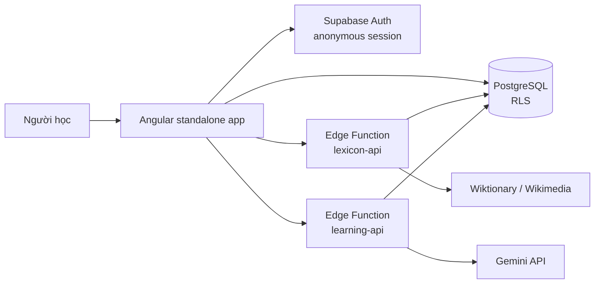
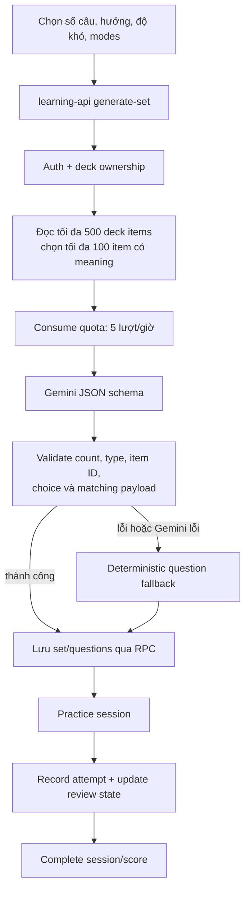

# Kiến trúc hiện tại

## Tổng quan runtime

Frontend có thể truy vấn một số dữ liệu trực tiếp qua Supabase JS client; thao tác cần xác thực nâng cao/provider/secret đi qua Edge Function. Hai function được deploy với `--no-verify-jwt`, vì vậy mỗi handler tự xác thực bearer token bằng `authenticatedUser()` trước khi xử lý. Function sau đó dùng admin client; phải tự kiểm tra ownership trước các thao tác riêng tư.

## Bootstrap và điều hướng

- `src/main.ts` gọi `bootstrapApplication(AppComponent, appConfig)`.
- `AppComponent` chỉ render `RouterOutlet`.
- `app.config.ts` bật zone event coalescing, async animations, router hash location và initializer khởi tạo anonymous session.
- `app.routes.ts` đặt các trang dưới `AppShellComponent`; root redirect đến `dashboard`, wildcard cũng về dashboard. Route deck gồm detail, add, vocabulary và practice.
- `AppShellComponent` cung cấp sidenav/topbar và báo lỗi cấu hình Supabase hoặc anonymous sign-in.
- `AnonymousSessionService` tái sử dụng session đang lưu hoặc gọi `signInAnonymously()`. Anonymous JWT mang role authenticated và RLS giới hạn dữ liệu.
- `SupabaseService` chỉ tạo client khi URL/key public có vẻ đã cấu hình. Chưa cấu hình thì một số màn hình ở UI preview, còn thao tác cần backend không thực hiện được.

## Bản đồ frontend

| Khu vực | File chính | Vai trò |
|---|---|---|
| Core | `core/auth/anonymous-session.service.ts`, `core/supabase/supabase.service.ts`, `core/config/app-config.ts` | Session, Supabase client và kiểm tra cấu hình |
| Shell/routes | `layout/app-shell.component.ts`, `app.routes.ts`, `app.config.ts` | Khung ứng dụng, route và providers |
| Dashboard | `features/dashboard/dashboard.component.ts`, `features/decks/deck.service.ts` | Deck gần đây, tổng từ và review streak |
| Decks | `features/decks/decks.component.ts`, `deck-detail.component.ts`, `deck.service.ts` | CRUD/archive deck, xem tổng quan/từ gần đây |
| Search/import | `features/search/add-vocabulary.component.ts`, `search.service.ts`, `function-error.ts` | Search debounce, batch, chọn candidate, hiển thị lỗi và import |
| Vocabulary | `features/vocabulary/vocabulary.component.ts`, `shared/components/dictionary-details.component.ts` | Search/filter/remove và chi tiết từ |
| Practice | `features/practice/practice.component.ts`, `practice.service.ts` | Cấu hình game, session, answer, feedback và tiến độ |
| Shared | `shared/models/domain.models.ts`, `shared/utils/*` | Hợp đồng domain, normalize, dictionary mapping, validation, learning/streak |

Angular dùng standalone components, Reactive Forms, Signals cho state đơn giản, RxJS cho search stream, Angular Material cho UI và Fuse.js để xếp hạng lại kết quả search đã tải về.

## Luồng deck và dashboard

`DeckService` đọc languages đã bật, list/get/create/update/archive deck, list/remove deck item và lấy dashboard stats. Deck list/detail join language metadata ở client. Vocabulary items được tải cùng lexeme, senses, translations, examples và review state.

Dashboard tải language và deck song song, sau đó đọc số deck item và timestamps của question attempts. `calculateReviewStreakDays()` gom ngày theo timezone local mặc định. Bộ lọc vocabulary dựa trên term/meaning và mastery/due state ở client.

## Luồng search và import

1. `AddVocabularyComponent` debounce query đơn 300 ms; query ngắn hơn 2 ký tự không gọi remote. Guard frontend phát hiện Japanese/Korean script không phù hợp với source language.
2. `SearchService.search()` gọi `lexicon-api` route `search`; Fuse.js xếp exact term lên trước kết quả fuzzy.
3. Backend xác thực user, validate language, chuẩn hóa cache key theo NFKC/whitespace/lowercase và tìm cache theo query + source/target language + provider version. Cache kết quả usable 7 ngày.
4. Cache miss gọi `WiktionaryProvider`: thử exact details, gọi MediaWiki search, lấy chi tiết tối đa bốn candidate đầu và bổ sung candidate còn lại dạng empty result. Provider hỗ trợ REST schema mới/cũ; metadata wikitext bổ sung translation, IPA/audio và Japanese romaji; REST Japanese 404/501 fallback sang wikitext.
5. Batch search gửi một request, tối đa 100 query, xử lý từng query với cùng cache. Import gửi các candidate được chọn; Edge Function kiểm tra deck ownership, source/target language và có definition; nếu candidate thiếu senses, lấy details từ provider. RPC `import_vocabulary_batch` upsert lexeme/sense/translation/example và thêm deck item theo unique constraint.
6. UI khóa candidate không có definition. `toLexiconError()` chuyển một số structured errors, auth, missing function và network/provider errors thành thông báo dễ hiểu.

## Luồng practice

`PracticeComponent` có setup/session/complete phases. AI generation có warning nếu backend fallback. Quick practice tạo câu hỏi deterministic phía frontend và không cần lưu exercise set; attempt/session được ghi qua `learning-api` khi Supabase cấu hình. Backend cập nhật spaced review qua RPC `record_review`; trả lời đúng tăng mastery/stability theo response time, trả lời sai giảm mastery và hẹn lại sau 10 phút.

## Provider và bảo mật

- Lexicon provider abstraction nằm trong `providers/provider.interface.ts`; runtime hiện tại chỉ khởi tạo `WiktionaryProvider`.
- Gemini chỉ được gọi từ `learning-api`; key đọc bằng `Deno.env`, không gửi xuống trình duyệt.
- `_shared/auth.ts` xác minh JWT với publishable key rồi tạo admin client từ secret key. `_shared/http.ts` chuẩn hóa CORS, JSON/error response, request ID và body parsing.
- `resolveSupabaseKeys()` chấp nhận hosted key maps lẫn legacy env names. Publishable key và secret key có fallback chains riêng.
- PostgreSQL RLS bật trên các bảng. User data có owner policies; shared lexical data cho authenticated read; cache/quota không cấp quyền client. RPC nhạy cảm bị revoke khỏi public/anon/authenticated và chỉ cấp execute cho service_role.

## Deployment và cấu hình

- Frontend local: `npm start`; build: `npm run build`.
- GitHub Pages workflow chạy Node 20, `npm ci`, ghi environment public từ GitHub secrets bằng `scripts/write-github-environment.mjs`, build với base path theo repository, copy `index.html` thành `404.html`, tạo `.nojekyll` và quét bundle tìm server secret marker trước deploy.
- Angular dùng hash routing để route share/refresh trên Pages.
- Supabase CLI dùng migration trong `supabase/migrations/`; `infra/supabase.sql` là script tương đương cho thao tác thủ công.
- Function deploy: `supabase functions deploy lexicon-api --no-verify-jwt` và tương tự `learning-api`.
- Local Edge Function env mẫu ở `supabase/functions/.env.example`; file `.env` thật được ignore.
- `supabase/config.toml` bật anonymous sign-in local và `verify_jwt = false` cho hai function; xác thực bearer vẫn do code đảm nhiệm.

## Blueprint và phần chưa có runtime

`bd.md` mô tả hướng mở rộng. Trong code hiện tại chưa thấy `ai-api`, provider Gemini cho lexicon, job queue/realtime workflow, storage upload, audit logs, semantic search/pgvector, social/shared decks, PWA/mobile, native login/profile UI hoặc các module riêng cho flashcards/progress/settings. Không tạo giả định rằng các thành phần này đã hoạt động chỉ vì blueprint nhắc tới.
